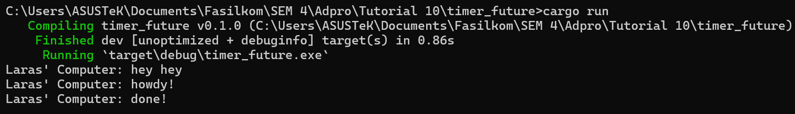

# Module 10: Asynchronous Programming
## Tutorial Advanced Programming 2023/2024 Genap

* Nama  : Tengku Laras Malahayati
* NPM   : 2206081641
* Kelas : A

## Reflection
### 1.2. Understanding How It Works

When I ran the program, the output displayed "hey hey" first, followed by "howdy!" and "done!". This sequence occurred 
because the command `println!("Laras' Computer: hey hey");` is placed outside the `async` function, which causes it to 
execute immediately. Subsequently, the code within the `async` function runs with a delay that also happened before code modification.