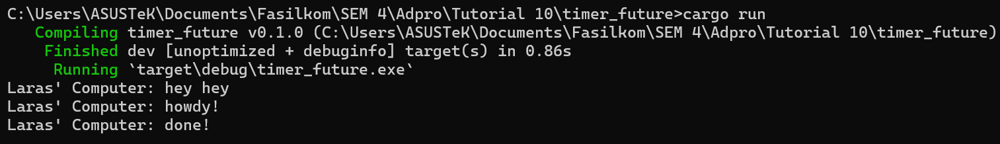

# Module 10: Asynchronous Programming
## Tutorial Advanced Programming 2023/2024 Genap

* Nama  : Tengku Laras Malahayati
* NPM   : 2206081641
* Kelas : A

## Reflection
### 1.2. Understanding How It Works

When I ran the program, the output displayed "hey hey" first, followed by "howdy!" and "done!". This sequence occurred 
because the command `println!("Laras' Computer: hey hey");` is placed outside the `async` function, which causes it to 
execute immediately. Subsequently, the code within the `async` function runs with a delay that also happened before code modification.

### 1.3 Multiple Spawn and removing drop
Here is the output when I executed the program after multiple spawn without `drop (spawner);`: 
.png)
While here is with `drop(spawner);`:
.png)

If there are many spawn calls, then there will be many tasks that will be executed asynchronously. Each task will be 
added to the executor queue and will be executed when the executor gets the chance to run it. As a result, the "howdy" and "done"
commands are not showed sequentially because there is a time delay between each execution. 

When `drop(spawner)` is removed, the executor will continue to wait for other tasks to be spawned, even after all the spawned tasks have finished.
This is because the executor uses `drop(spawner)` as a signal which indicates there are no more tasks to be spawned.